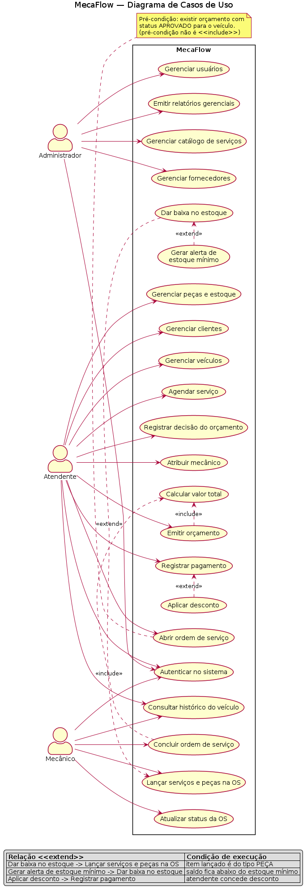
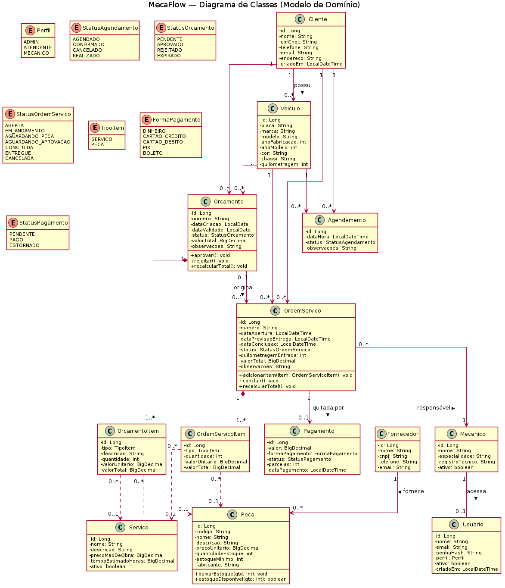
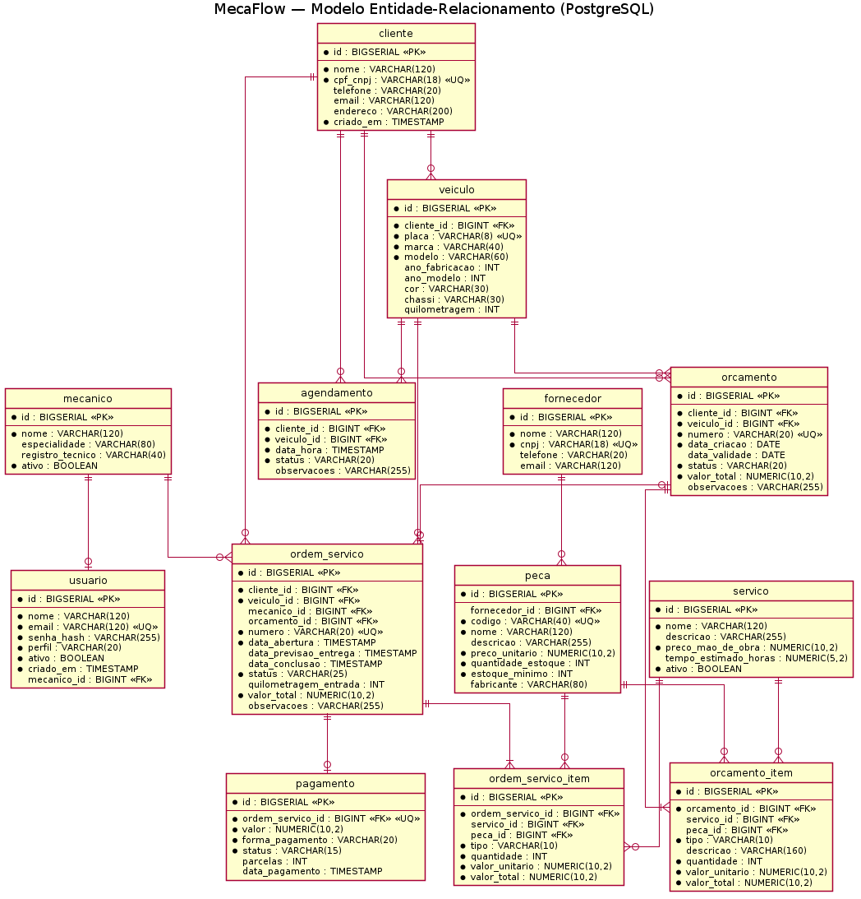
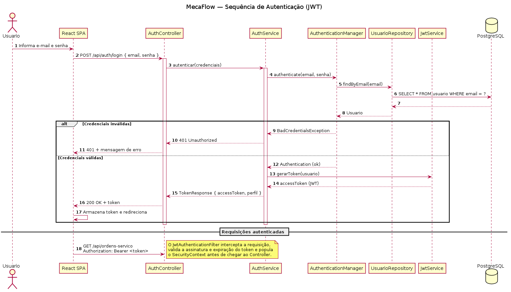
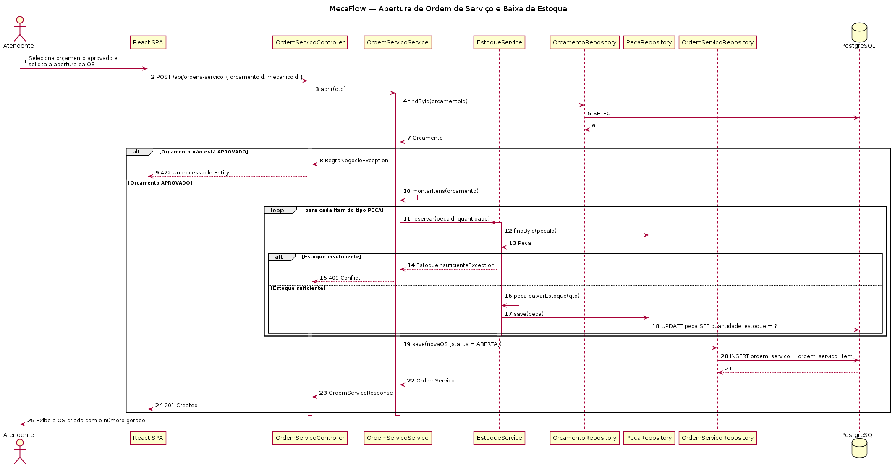
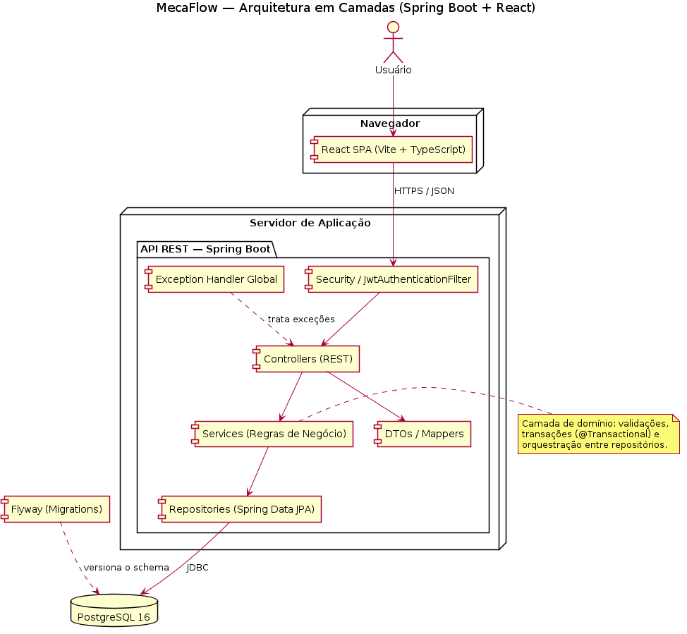

<div align="center">


# 🔧 MecaFlow 👨‍💻

</div>

> [!NOTE]
> Sistema de gestão para oficinas mecânicas de pequeno e médio porte. Cobre o ciclo completo do reparo: agendamento, orçamento, ordem de serviço, estoque de peças e pagamento, com histórico permanente de cada veículo.

<table>
  <tr>
    <td width="800px">
      <div align="justify">
        O <b>MecaFlow</b> organiza a rotina de uma oficina mecânica em um único sistema. Em muitas oficinas, o atendente anota o orçamento num bloco de papel, o mecânico troca a peça sem registrar a saída do estoque e o dono descobre o furo no fim do mês. O MecaFlow centraliza esse fluxo: o atendente cadastra cliente e veículo uma vez, emite orçamentos com itens de serviço e peça, registra a decisão do cliente e abre a ordem de serviço. O mecânico atualiza o status do reparo e lança o que consumiu; cada peça lançada debita o estoque na hora. Três perfis controlam o acesso (administrador, atendente e mecânico) sobre uma API REST em <b>Spring Boot</b> com autenticação <b>JWT</b> e um front-end em <b>React</b>. Este repositório documenta a fase de <b>modelagem e arquitetura</b> do sistema, desenvolvida como trabalho acadêmico: diagramas em <b>PlantUML</b>, decisões de projeto e este README. A implementação do código fica fora do escopo desta etapa.
      </div>
    </td>
    <td>
      <div align="center">
        
      </div>
    </td>
  </tr>
</table>

---

## 🚧 Status do Projeto


[](#)


> Projeto na fase de **modelagem e arquitetura**. Os diagramas de casos de uso, classes, entidade-relacionamento, sequência, componentes e implantação estão versionados em [`docs/diagrams`](docs/diagrams), em formato **PlantUML** (`.puml`) com os respectivos `.png` renderizados. Esta etapa entrega o projeto da aplicação, sem código.

---

## 📚 Índice
- [Links Úteis](#-links-úteis)
- [Sobre o Projeto](#-sobre-o-projeto)
- [Funcionalidades Principais](#-funcionalidades-principais)
- [Tecnologias Utilizadas](#-tecnologias-utilizadas)
- [Arquitetura](#-arquitetura)
  - [Diagramas do Projeto](#diagramas-do-projeto)
- [Instalação e Execução](#-instalação-e-execução)
  - [Pré-requisitos](#pré-requisitos)
  - [Variáveis de Ambiente](#-variáveis-de-ambiente)
  - [Instalação de Dependências](#-instalação-de-dependências)
  - [Inicialização do Banco de Dados (PostgreSQL)](#-inicialização-do-banco-de-dados-postgresql)
  - [Como Executar a Aplicação](#-como-executar-a-aplicação)
  - [Como Gerar os Diagramas (PlantUML)](#-como-gerar-os-diagramas-plantuml)
- [Deploy](#-deploy)
- [Estrutura de Pastas](#-estrutura-de-pastas)
- [Demonstração](#-demonstração)
- [Testes](#-testes)
- [Documentações utilizadas](#-documentações-utilizadas)
- [Autores](#-autores)
- [Contribuição](#-contribuição)
- [Licença](#-licença)

---

## 🔗 Links Úteis
* 🌐 **Demo Online:** [mecaflow.vercel.app](https://mecaflow.vercel.app)
  > 💻 **Descrição:** Aplicação web em produção, hospedada na Vercel (link ilustrativo; a publicação ocorre após a implementação).
* 📖 **Documentação da API:** [Swagger / OpenAPI](https://mecaflow-api.up.railway.app/swagger-ui.html)
  > 📚 **Descrição:** Documentação dos endpoints REST gerada pelo springdoc-openapi (link ilustrativo).
* 📐 **Diagramas (PlantUML):** [docs/diagrams](docs/diagrams)
  > 🗂️ **Descrição:** Código-fonte `.puml` e imagens `.png` de todos os diagramas do sistema.

---

## 📝 Sobre o Projeto

O MecaFlow nasceu de um problema concreto: a oficina de bairro perde dinheiro por falta de controle. O atendente preenche o orçamento num bloco de papel, o mecânico troca a peça sem dar baixa no estoque e, quando o cliente volta seis meses depois, ninguém lembra o que o carro já fez.

**Por que ele existe.** Para substituir cadernos e planilhas soltas por um sistema único que registra cada atendimento e preserva o histórico de cada veículo.

**Qual problema ele resolve.**
- A oficina perde o histórico de serviços do veículo.
- Peças saem do estoque sem registro e o saldo real diverge do papel.
- Orçamentos em papel somem e ninguém rastreia quem aprovou o quê.
- O dono não enxerga faturamento por período nem a produtividade de cada mecânico.

**Qual o contexto.** Trabalho acadêmico de Engenharia de Software (PUC Minas), com foco em modelagem, diagramação e arquitetura. O escopo cobre o projeto da aplicação; o código fica para uma etapa futura.

**Onde ele pode ser utilizado.** Oficinas independentes e centros automotivos de pequeno e médio porte que precisam organizar agendamentos, orçamentos, ordens de serviço e estoque.

**O que ele entrega de valor.** O atendente fecha orçamentos com rastreio de aprovação, o mecânico sabe o que fazer em cada OS, o estoque reflete a realidade e o dono lê o faturamento em um relatório em vez de somar notas à mão.

---

## ✨ Funcionalidades Principais

- 🔐 **Autenticação e perfis de acesso:** Login com JWT e três perfis (Administrador, Atendente, Mecânico), cada um com permissões próprias.
- 👤 **Clientes e veículos:** Cadastro de clientes e dos veículos vinculados, com placa, modelo, quilometragem e histórico de atendimentos.
- 📅 **Agendamento:** Marcação de serviços por cliente e veículo, com controle de status.
- 🧰 **Catálogo de serviços:** Cadastro de serviços com preço de mão de obra e tempo estimado.
- 📦 **Estoque de peças e fornecedores:** Controle de quantidade, estoque mínimo e fornecedor de cada peça, com alerta de reposição.
- 🧾 **Orçamentos:** Emissão de orçamento com itens de serviço e peça, prazo de validade e registro da aprovação ou rejeição do cliente.
- 🛠️ **Ordens de serviço:** Abertura a partir de orçamento aprovado, atribuição de mecânico e acompanhamento de status (aberta, em andamento, aguardando peça, concluída, entregue).
- 🔄 **Baixa automática de estoque:** Cada peça lançada na OS debita o estoque na hora.
- 💳 **Pagamentos:** Registro por forma de pagamento (dinheiro, cartão, Pix, boleto) e parcelas.
- 📊 **Relatórios gerenciais:** Faturamento por período, serviços mais vendidos e produtividade dos mecânicos.

---

## 🛠 Tecnologias Utilizadas

As versões abaixo são as recomendadas para o projeto. Use-as, ou superiores, para garantir compatibilidade.

### 💻 Front-end

* **Biblioteca:** React 19
* **Linguagem:** TypeScript 5.5
* **Build Tool:** Vite 7
* **Estilização:** Tailwind CSS 3.4
* **Gerenciamento de Estado:** Zustand + React Query (TanStack Query)
* **Cliente HTTP:** Axios
* **Roteamento:** React Router 6

### 🖥️ Back-end

* **Linguagem/Runtime:** Java 21 (JDK)
* **Framework:** Spring Boot 3.3.5 (Spring Web, Spring Data JPA, Spring Validation)
* **Banco de Dados:** PostgreSQL 16
* **ORM:** Hibernate / JPA
* **Migrações:** Flyway
* **Autenticação:** Spring Security + JWT (jjwt)
* **Documentação da API:** springdoc-openapi (Swagger UI)
* **Build:** Maven 3.9

### ⚙️ Infraestrutura & DevOps

* **Containerização:** Docker + Docker Compose
* **Cloud (sugerida):** Vercel (front), Railway (API e banco)
* **CI/CD:** GitHub Actions
* **Qualidade:** SonarQube (análise estática)
* **Diagramação:** PlantUML

---

## 🏗 Arquitetura

O MecaFlow segue uma arquitetura de **monólito modular em camadas**. A API REST em Spring Boot adota o padrão **MVC + Service Layer + Repository**, e o front-end React consome essa API.

**Visão geral das camadas (back-end):**

- **Controller (REST):** recebe as requisições HTTP, valida o formato de entrada e delega para a camada de serviço. Não contém regra de negócio.
- **Service (regras de negócio):** concentra as regras do domínio (abertura de OS, aprovação de orçamento, baixa de estoque), controla transações com `@Transactional` e orquestra os repositórios.
- **Repository (Spring Data JPA):** abstrai o acesso ao PostgreSQL.
- **Model / Domain:** entidades JPA que representam o domínio da oficina.
- **DTO / Mapper:** objetos de transporte que isolam as entidades das respostas da API.
- **Security:** filtro JWT que autentica e autoriza cada requisição antes do Controller.
- **Exception Handler:** tratamento global de erros, com respostas padronizadas.

**Padrões de projeto adotados:** Repository, Service Layer, DTO, Mapper e Dependency Injection (nativa do Spring).

**Por que essa arquitetura.** O escopo é um sistema de gestão único, mantido por uma equipe pequena. Um monólito modular separa responsabilidades, simplifica testes e exige um único deploy. Microsserviços trariam custo operacional sem benefício neste porte. Os módulos (clientes, veículos, orçamentos, ordens de serviço, estoque) ficam isolados por pacote, o que permite extrair um serviço no futuro se o sistema crescer.

**Fluxo de dados (resumo):** o React envia uma requisição JSON para a API; o filtro de segurança valida o token JWT; o Controller converte o DTO e chama o Service; o Service aplica as regras e usa os Repositories; o Spring Data JPA persiste no PostgreSQL; a resposta volta como DTO até o front-end.

**Trade-offs.** O monólito compartilha um único banco e um único processo de deploy: uma falha grave derruba o sistema inteiro, e a escala é vertical. Para o porte de uma oficina, a simplicidade compensa essas limitações.

### Diagramas do Projeto

Todos os diagramas estão em [`docs/diagrams`](docs/diagrams), com o fonte PlantUML (`.puml`) e a imagem renderizada (`.png`).

| Diagrama | Visualização | Fonte PlantUML |
| :--- | :---: | :---: |
| **Casos de Uso** (com `<<include>>` e `<<extend>>`) | [PNG](docs/diagrams/01-casos-de-uso.png) | [.puml](docs/diagrams/01-casos-de-uso.puml) |
| **Classes (Domínio)** | [PNG](docs/diagrams/02-classes.png) | [.puml](docs/diagrams/02-classes.puml) |
| **Entidade-Relacionamento** | [PNG](docs/diagrams/03-entidade-relacionamento.png) | [.puml](docs/diagrams/03-entidade-relacionamento.puml) |
| **Sequência: Autenticação (JWT)** | [PNG](docs/diagrams/04-sequencia-autenticacao.png) | [.puml](docs/diagrams/04-sequencia-autenticacao.puml) |
| **Sequência: Abertura de OS** | [PNG](docs/diagrams/05-sequencia-abertura-os.png) | [.puml](docs/diagrams/05-sequencia-abertura-os.puml) |
| **Componentes / Arquitetura** | [PNG](docs/diagrams/06-componentes-arquitetura.png) | [.puml](docs/diagrams/06-componentes-arquitetura.puml) |
| **Implantação (Docker/Cloud)** | [PNG](docs/diagrams/07-implantacao.png) | [.puml](docs/diagrams/07-implantacao.puml) |

<div align="center">

**Casos de Uso** · **Classes** · **Entidade-Relacionamento**

  

**Sequência (Autenticação)** · **Sequência (Abertura de OS)** · **Componentes**

  

</div>

---

## 🔧 Instalação e Execução

> [!NOTE]
> Esta etapa do trabalho entrega a modelagem. Os comandos abaixo servem de referência para a futura implementação e para gerar os diagramas.

### Pré-requisitos

* **Java JDK:** versão **21** ou superior (back-end Spring Boot e geração dos diagramas)
* **Node.js:** versão LTS (v20.x ou superior) (front-end React)
* **Gerenciador de pacotes:** npm ou yarn
* **PostgreSQL 16** (ou via Docker)
* **Docker** (opcional, recomendado para o banco)
* **PlantUML** (`plantuml.jar` ou extensão do VS Code)

---

### 🔑 Variáveis de Ambiente

#### 1 Back-end (Spring Boot)

Configure como variáveis de ambiente do sistema ou em `application.yml`.

| Variável | Descrição | Exemplo |
| :--- | :--- | :--- |
| `SERVER_PORT` | Porta do back-end. | `8080` |
| `SPRING_DATASOURCE_URL` | URL JDBC do PostgreSQL. | `jdbc:postgresql://localhost:5432/mecaflow` |
| `SPRING_DATASOURCE_USERNAME` | Usuário do banco. | `postgres` |
| `SPRING_DATASOURCE_PASSWORD` | Senha do banco. | `senha-segura-123` |
| `JWT_SECRET` | Chave para assinatura dos tokens JWT. | `chave_super_segura_base64` |
| `JWT_EXPIRATION` | Validade do token em milissegundos. | `3600000` |

#### 2 Front-end (React, Vite)

Crie um arquivo `.env.local` na raiz de `/mecaflow-web`. O Vite expõe ao bundle as variáveis com prefixo `VITE_`; sem o prefixo, a variável não chega ao código do cliente.

| Variável | Descrição | Exemplo |
| :--- | :--- | :--- |
| `VITE_API_URL` | URL base da API Spring Boot. | `http://localhost:8080/api` |

Conteúdo de `mecaflow-web/.env.local`:

```
VITE_API_URL=http://localhost:8080/api
```

#### 3 Variáveis de Ambiente na Vercel

No painel da Vercel (Project Settings > Environment Variables), cadastre a variável do front-end apontando para a API de produção:

```
VITE_API_URL=https://mecaflow-api.up.railway.app/api
```

Para adicionar: acesse a página de Environment Variables do projeto e clique em **"Add"** com nome e valor correspondentes.

---

### 📦 Instalação de Dependências

1. **Clone o repositório:**

```bash
git clone https://github.com/iTsLJ/mecaflow.git
cd mecaflow
```

2. **Front-end (React):**

```bash
cd mecaflow-web
npm install
cd ..
```

3. **Back-end (Spring Boot, Maven):**

```bash
cd mecaflow-api
./mvnw clean install
cd ..
```

---

### 💾 Inicialização do Banco de Dados (PostgreSQL)

1. **Suba o container do PostgreSQL** (com o Docker em execução):

```bash
docker run --name mecaflow-db \
  -e POSTGRES_USER=postgres \
  -e POSTGRES_PASSWORD=senha-segura-123 \
  -e POSTGRES_DB=mecaflow \
  -p 5432:5432 -d postgres:16
```

2. **Execute as migrações.** O **Flyway** aplica as migrações na inicialização do back-end. Para rodar manualmente:

```bash
cd mecaflow-api
./mvnw flyway:migrate
```

---

### ⚡ Como Executar a Aplicação

Use dois terminais.

#### Terminal 1: Back-end (Spring Boot)

```bash
cd mecaflow-api
./mvnw spring-boot:run
```
🚀 *API em **http://localhost:8080** · Swagger em **http://localhost:8080/swagger-ui.html***

#### Terminal 2: Front-end (React, Vite)

```bash
cd mecaflow-web
npm run dev
```
🎨 *Front-end em **http://localhost:5173***

#### 🐳 Execução Local Completa com Docker Compose (Incluindo Banco de Dados)

Na raiz do projeto, onde está o `docker-compose.yml`:

```bash
docker-compose up --build -d
```

> [!NOTE]
> 💡 `--build` regenera as imagens do projeto e `-d` executa em segundo plano.

Verifique os containers e acompanhe as migrações do Flyway nos logs:

```bash
docker ps
docker logs mecaflow-api
```

Para parar e remover containers e redes:

```bash
docker-compose down
```

---

### 📐 Como Gerar os Diagramas (PlantUML)

> O trabalho exige **PlantUML**. Os fontes `.puml` estão em `docs/diagrams`.

**Opção 1: VS Code.** Instale a extensão **PlantUML** (jebbs.plantuml) e use `Alt+D` para pré-visualizar cada `.puml`.

**Opção 2: linha de comando** (requer Java e o `plantuml.jar`):

```bash
# Gera os PNG de todos os diagramas
java -jar plantuml.jar -tpng -charset UTF-8 docs/diagrams/*.puml

# Exporta em SVG
java -jar plantuml.jar -tsvg -charset UTF-8 docs/diagrams/*.puml
```

**Opção 3: online.** Cole o conteúdo do `.puml` no [PlantUML Web Server](https://www.plantuml.com/plantuml).

---

## 🚀 Deploy

1. **Build dos artefatos:**

```bash
# 1. Build do Front-end (React/Vite): gera a pasta /dist com arquivos estáticos
cd mecaflow-web
npm run build

# 2. Build do Back-end (Spring Boot/Maven): gera o .jar executável em /target
cd ../mecaflow-api
./mvnw clean package
```

2. **Configuração do ambiente de produção:** defina as variáveis no provedor (Vercel para o front, Railway para a API).

> 🔑 **Variáveis cruciais:** configure a conexão com o banco (`SPRING_DATASOURCE_URL`, `SPRING_DATASOURCE_USERNAME`, `SPRING_DATASOURCE_PASSWORD`, `JWT_SECRET`) no back-end e a URL da API de produção (`VITE_API_URL`) no front-end.

3. **Execução em produção:**

```bash
# ☕ Back-end Spring Boot (Java JAR)
java -jar mecaflow-api/target/mecaflow-api-0.0.1-SNAPSHOT.jar

# 🟢 Front-end: arquivos estáticos servidos por um servidor web
npm install -g serve
serve -s mecaflow-web/dist
```

---

## 📂 Estrutura de Pastas

```
.
├── .gitignore                   # 🧹 Arquivos ignorados (target, node_modules, .env, etc.).
├── README.md                    # 📘 Documentação principal do projeto.
├── CONTRIBUTING.md              # 🤝 Guia de contribuição.
├── LICENSE                      # ⚖️ Licença MIT.
├── docker-compose.yml           # 🐳 Orquestração dos containers (api + web + db).
│
├── /docs                        # 📚 Documentação e diagramas
│   ├── /assets                  # 🖼️ Logo e imagens do projeto.
│   │   └── logo.svg
│   └── /diagrams                # 📐 Diagramas PlantUML (obrigatório)
│       ├── 01-casos-de-uso.puml / .png
│       ├── 02-classes.puml / .png
│       ├── 03-entidade-relacionamento.puml / .png
│       ├── 04-sequencia-autenticacao.puml / .png
│       ├── 05-sequencia-abertura-os.puml / .png
│       ├── 06-componentes-arquitetura.puml / .png
│       └── 07-implantacao.puml / .png
│
├── /mecaflow-web                # 📁 Front-end (React + Vite)
│   ├── .env.example             # 🧩 Variáveis de ambiente do front-end.
│   ├── Dockerfile               # 🐳 Docker build do front-end.
│   ├── /public                  # 📂 Arquivos estáticos.
│   ├── /src                     # 📂 Código-fonte React
│   │   ├── /components          # 🧱 Componentes de UI reutilizáveis.
│   │   ├── /pages               # 📄 Páginas/rotas da aplicação.
│   │   ├── /services            # 🔌 Chamadas HTTP (Axios).
│   │   ├── /hooks               # 🎣 Hooks personalizados.
│   │   ├── /store               # 🗃️ Estado global (Zustand).
│   │   └── /styles              # 🎨 Estilos e tema.
│   ├── package.json             # 📦 Dependências e scripts.
│   └── vite.config.ts           # ⚙️ Configuração do Vite.
│
└── /mecaflow-api                # 📁 Back-end (Spring Boot)
    ├── .env.example             # 🧩 Variáveis de ambiente do back-end.
    ├── Dockerfile               # 🐳 Docker build do back-end.
    ├── /src/main/java/com/mecaflow/api
    │   ├── /controller          # 🎮 Endpoints REST.
    │   ├── /service             # ⚙️ Regras de negócio.
    │   ├── /repository          # 🗄️ Repositórios (Spring Data JPA).
    │   ├── /model               # 🧬 Entidades JPA.
    │   ├── /dto                 # ✉️ Data Transfer Objects.
    │   ├── /mapper              # 🔁 Conversão Entidade <-> DTO.
    │   ├── /config              # 🔧 Configurações (CORS, Swagger, etc.).
    │   ├── /exception           # 💥 Handlers globais de erro.
    │   └── /security            # 🛡️ Spring Security + JWT.
    │
    ├── /src/main/resources
    │   ├── application.yml          # ⚙️ Configuração principal.
    │   ├── application-dev.yml      # 🧪 Perfil de desenvolvimento.
    │   ├── application-prod.yml     # 🚀 Perfil de produção.
    │   └── /db/migration            # 📜 Migrações Flyway (V1__init.sql, ...).
    │
    ├── /src/test/java           # 🧪 Testes unitários e de integração.
    └── pom.xml                  # 🛠️ Build e dependências (Maven).
```

---

## 🎥 Demonstração

> [!WARNING]
> As telas serão capturadas após a implementação da interface. Hospede as imagens em um CDN ou no GitHub Pages para evitar links quebrados.

### 🌐 Aplicação Web

| Tela | Captura de Tela |
| :---: | :---: |
| **Login** | **Dashboard** |
| _Em desenvolvimento_ | _Em desenvolvimento_ |
| **Ordens de Serviço** | **Estoque de Peças** |
| _Em desenvolvimento_ | _Em desenvolvimento_ |

### 💻 Exemplo de Saída no Terminal (Back-end / API)

#### 1. Demonstração da API (cURL)

```bash
# Lista as ordens de serviço com o token de autenticação
curl -X GET 'http://localhost:8080/api/ordens-servico' \
     -H 'Authorization: Bearer <seu-jwt-token>'
```

**Saída esperada:**
```json
{
  "total": 1,
  "ordens": [
    {
      "id": 1,
      "numero": "OS-2026-0001",
      "status": "EM_ANDAMENTO",
      "cliente": "João da Silva",
      "veiculo": "Fiat Argo - QXR2B34",
      "mecanico": "Carlos Pereira",
      "valorTotal": 480.00
    }
  ]
}
```

#### 2. Demonstração das Migrações (Flyway)

```bash
cd mecaflow-api
./mvnw flyway:info
```

**Saída esperada:**
```text
+-----------+---------+-----------------------------+------+---------------------+---------+
| Category  | Version | Description                 | Type | Installed On        | State   |
+-----------+---------+-----------------------------+------+---------------------+---------+
| Versioned | 1       | init schema                 | SQL  | 2026-06-09 10:12:01 | Success |
| Versioned | 2       | create ordem servico        | SQL  | 2026-06-09 10:12:02 | Success |
| Versioned | 3       | create pagamento            | SQL  | 2026-06-09 10:12:02 | Success |
+-----------+---------+-----------------------------+------+---------------------+---------+
```

---

## 🧪 Testes

> Estratégia de testes prevista para a fase de implementação.

### Testes Unitários e de Integração (back-end)

```bash
cd mecaflow-api
./mvnw test
```
*Ferramentas: JUnit 5, Mockito, Spring Boot Test, Testcontainers.*

### Testes de Front-end

```bash
cd mecaflow-web
npm run test
```
*Ferramentas: Vitest, React Testing Library.*

---

## 🔗 Documentações utilizadas

* 📖 **Front-end:** [Documentação Oficial do React](https://react.dev/reference/react)
* 📖 **Build Tool:** [Guia de Configuração do Vite](https://vitejs.dev/config/)
* 📖 **Back-end:** [Documentação Oficial do Spring Boot](https://docs.spring.io/spring-boot/docs/current/reference/html/)
* 📖 **Persistência:** [Spring Data JPA](https://docs.spring.io/spring-data/jpa/reference/)
* 📖 **Migrações:** [Flyway](https://documentation.red-gate.com/fd)
* 📖 **Diagramação:** [PlantUML](https://plantuml.com/)
* 📖 **Containerização:** [Documentação de Referência do Docker](https://docs.docker.com/)
* 📖 **Padrão de commits:** [Conventional Commits](https://www.conventionalcommits.org/en/v1.0.0/)

---

## 👥 Autores

| 👤 Nome | :octocat: GitHub | 💼 LinkedIn | 📤 Gmail |
|---------|-----------------|-------------|-----------|
| Lucas José Lopes Ferreira | [GitHub](https://github.com/iTsLJ) | [LinkedIn](https://www.linkedin.com/in/lucas-ferreira10/) | [E-mail](mailto:lucasjlopesferreira@gmail.com) |

---

## 🤝 Contribuição

1. Faça um `fork` do projeto.
2. Crie uma branch para sua feature (`git checkout -b feature/minha-feature`).
3. Faça o commit (`git commit -m 'feat: adiciona funcionalidade X'`). Use [Conventional Commits](https://www.conventionalcommits.org/en/v1.0.0/).
4. Faça o `push` para a branch (`git push origin feature/minha-feature`).
5. Abra um **Pull Request (PR)**.

> [!IMPORTANT]
> 📝 **Regras:** consulte o [`CONTRIBUTING.md`](./CONTRIBUTING.md) para o guia de estilo e o processo de submissão de PRs.

---

## 📄 Licença

Este projeto é distribuído sob a **[Licença MIT](LICENSE)**.

---
